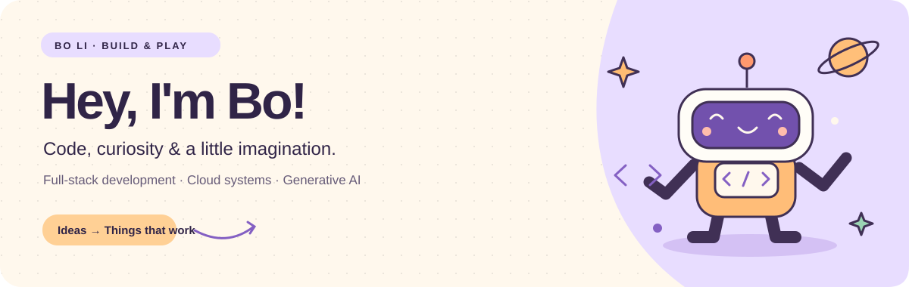

  

  <a href="https://li-bo-github.github.io/"><b>🌏 Portfolio</b></a> &nbsp; · &nbsp;
  <a href="https://www.linkedin.com/in/lavidabo/">💬 LinkedIn</a> &nbsp; · &nbsp;
  <a href="mailto:libo.tom.mail@gmail.com">✉️ Say hello</a>

### 🪐 A little about me

I'm **Bo Li**, a software engineer exploring the space between **full-stack development, cloud infrastructure, and generative AI**.

I enjoy turning ideas into useful things and exploring new possibilities at the intersection of AI and creativity.

- ☁️ **Previously at Amazon** — backend systems, event-driven workflows, and a Bedrock AI assistant.
- 🎓 **UIUC · Master of Computer Science** / **UW–Madison · Computer Science & Data Science**.
- 🌱 **Exploring** — AI-powered products, trustworthy RAG, and generative visual storytelling.
